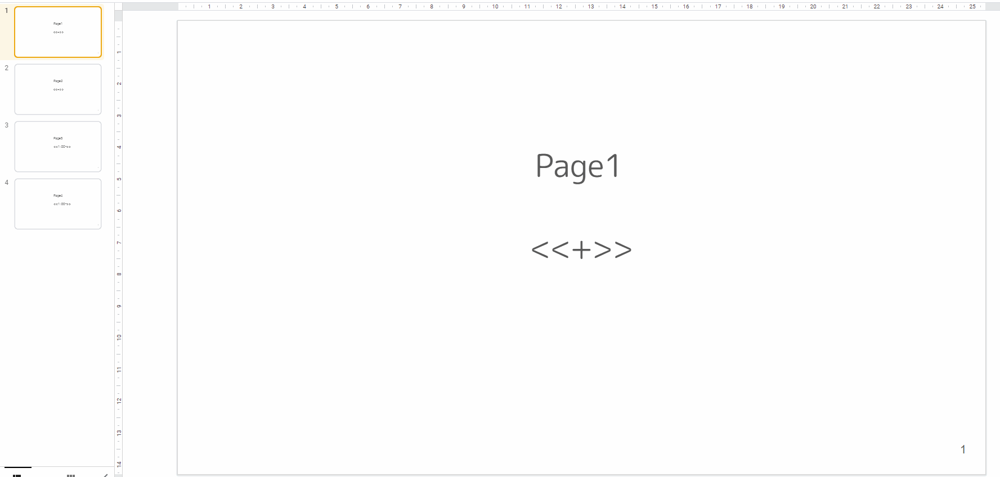

[English version is here](README_EN.md)

# ⏳ Presentation Timer

Presentation Timer は、Google Slides を使ったプレゼンテーション時間計測のための Google 拡張機能です！

 

## 🎥 デモ

 

## 💡 できること

- カウントダウン
- カウントアップ
- 日付の表示
- 現在時刻の表示
- 各スライドの要した時間(ラップタイム)の計測

 

## 📋 使い方

使い方は簡単！

⇩ のルールにあった文字をスライド内に入れるだけ！

- <<+>>
  - カウントアップ
  - 最初に <<+>> を使用した時間からカウントアップを開始する(全画面を選択して自動でカウントが開始されるわけではない)
- <<##:$$->>
  - カウントダウン
  - ex) <<2:00->>, <<99:59->>
  - 最初に <<##:$$->> を使用した時間からカウントダウンを開始する(全画面を選択して自動でカウントが開始されるわけではない)
- <\<today>>
  - その日の日付を表示
- <\<time>>
  - 現在時刻を表示

各スライドの要した時間(ラップタイム)の計測は、全画面終了時に自動で表示されます！
